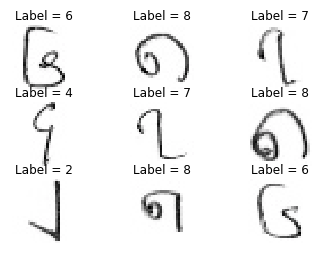

# BHDD
Burmese Handwritten Digits Dataset (inspired by MNIST dataset).

## Note about Git LFS
If you clone this repository without installing Git LFS, you will only fetch the pointer file for the dataset.
In order to get the original dataset, you need to have Git LFS or download the `RAW` file directly.

## Sample Digits

