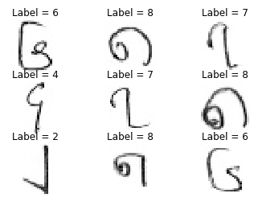

# Burmese Handwritten Digit Dataset (BHDD)

[](https://arxiv.org/abs/2603.21966)
[](https://creativecommons.org/licenses/by-sa/4.0/)
[](https://www.gnu.org/licenses/lgpl-3.0)

The **Burmese Handwritten Digit Dataset (BHDD)** is a dataset project specifically created for recognizing handwritten Burmese digits. It serves as the Burmese counterpart to the renowned MNIST dataset and is designed to facilitate learning and benchmarking in Machine Learning (ML) and Deep Learning (DL).

> **Note on naming:** The canonical name of this dataset is **BHDD** (Burmese Handwritten Digit Dataset). Some third-party publications may refer to this dataset by other names, but **BHDD** remains the official designation by its creators. Please use "BHDD" when citing or referencing this dataset.



---

## Overview

**Dataset Statistics:**

- **Training Set:** 60,000 samples
- **Testing Set:** 27,561 samples
- **Number of Classes:** 10 (Burmese digits 0–9)

**Data Format:**

- **Train Image Shape:** `(60000, 784)`
- **Train Label Shape:** `(60000,)`
- **Test Image Shape:** `(27561, 784)`
- **Test Label Shape:** `(27561,)`

The dataset was collected from over 150 individuals of different ages (ranging from high school students to professionals in their 50s) and diverse occupations (including clerks, programmers, and others) to achieve a wide variety of handwriting styles. We then preprocessed to mirror the structure and functionality of MNIST.

---

## Dataset Content

The dataset consists of:

1. **Train Images**: 60,000 grayscale images of handwritten Burmese digits, flattened into a 1D array of size 784 (28x28 pixels).
2. **Train Labels**: Integer labels (0--9) corresponding to the digit class.
3. **Test Images**: 27,561 grayscale images for testing purposes.
4. **Test Labels**: Integer labels (0--9) for testing data.

---

## Installation

Clone this repository to get started:

```bash
git clone https://github.com/baseresearch/BHDD.git
cd BHDD
```

---

## Usage and Visualizing

We have provided usage and visualization notebooks in this repo. Please check them.

---

## Contribution

We encourage the ML/DL community to contribute by:

- Creating digit recognizers.
- Benchmarking with different models and algorithms.
- Writing tutorials and sharing findings.

For contributions, please fork the repository, make your changes, and submit a pull request.

---

## Citation

If you use the BHDD dataset in your research, publications, or derivative work, you must cite the following paper:

```bibtex
@article{bhdd2026,
  author    = {Swan Htet Aung and Hein Htet and Htoo Say Wah Khaing and Thuya Myo Nyunt},
  title     = {{BHDD}: A Burmese Handwritten Digit Dataset},
  journal   = {arXiv preprint arXiv:2603.21966},
  year      = {2026},
  url       = {https://arxiv.org/abs/2603.21966}
}
```

To reference the dataset repository directly:

```bibtex
@dataset{bhdd_repo,
  author    = {Swan Htet Aung and Hein Htet and Htoo Say Wah Khaing and Thuya Myo Nyunt and {Expa.AI Research Team}},
  title     = {{BHDD}: Burmese Handwritten Digit Dataset},
  year      = {2019},
  publisher = {GitHub},
  url       = {https://github.com/baseresearch/BHDD},
  note      = {Dataset: CC BY-SA 4.0, Code: LGPL-3.0}
}
```

---

## Core Contributors

- **Swan Htet Aung** — Lead Researcher, Expa.AI
- **Hein Htet** — Research Engineer, Expa.AI
- **Htoo Say Wah Khaing** — Data Engineer, Expa.AI
- **Thuya Myo Nyunt** — Technical Lead, Expa.AI

And other members of the Expa.AI Research Team.

---

## Acknowledgments

This dataset would not have been possible without:

- The efforts of the Expa.AI Research Team.
- Volunteers and interns from Taungoo Computer University who contributed handwriting samples.
- High school students from St. Augustine / B.E.H.S (2) Kamayut.
- Friends and family members of the Expa.AI Research Team.
- The community's ongoing support and interest in ML/DL for the Burmese language.

---

## License

This project uses a dual license:

- **Dataset** (images, labels, and data files): [CC BY-SA 4.0](https://creativecommons.org/licenses/by-sa/4.0/)
- **Code** (scripts, notebooks, and software): [LGPL-3.0](https://www.gnu.org/licenses/lgpl-3.0.html)

See the [LICENSE](LICENSE) file for full details.

---

## Contact

For questions, suggestions, or feedback, please reach out to our team by opening an issue.

---

Let's build the Burmese ML/DL ecosystem together!

## Note about Git LFS

If you clone this repository without installing Git LFS, you will only fetch the pointer file for the dataset.
In order to get the original dataset, you need to have Git LFS or download the `RAW` file directly.
